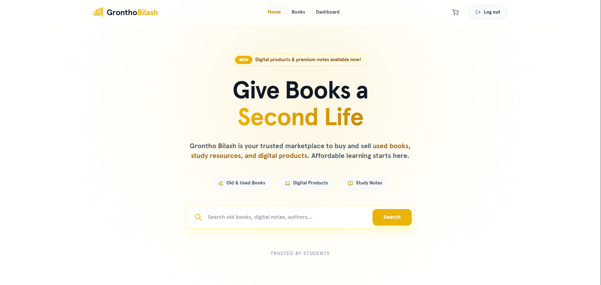

# Grontho Bilash (গ্রন্থ বিলাস)



**Grontho Bilash** is a modern, full-stack educational marketplace and platform designed for university students. It empowers students to easily buy and sell academic resources—from physical textbooks and handwritten notes to digital PDF guidelines and softcovers. By fostering an academic sharing economy, Grontho Bilash makes higher education more affordable and accessible.

---

## ✨ Key Features

### 🛒 Comprehensive Marketplace
* **Physical & Digital Products:** Support for both physical books (hardcovers/notes) and digital content (PDFs/softcovers).
* **Secure Digital Delivery:** Purchased digital products unlock a secure download link directly in the user's dashboard.
* **Smart Search & Filtering:** Filter resources by education level, faculty, department, condition, and price.

### 👤 User & Order Management
* **Modern User Dashboard:** A sleek, intuitive dashboard (built with Ant Design & Tailwind CSS) to manage listed products and track purchase history.
* **Order Tracking & Actions:** Real-time order status tracking with the ability to edit delivery details or cancel pending orders.
* **Secure Authentication:** Robust JWT-based authentication ensuring data privacy and secure transactions.

### ⚙️ Admin & Platform Controls
* **Admin Dashboard:** Centralized control panel for platform administrators to oversee transactions, product listings, and user management.
* **Transaction Handling:** Automated platform fee calculations and shipping cost estimates.

### 🛠️ Built-in Student Tools
* **CGPA Calculator:** An integrated tool helping students track and calculate their academic performance effortlessly.

---

## 💻 Tech Stack

This project is built using the **MERN** stack, adhering to modern web development best practices:

### Frontend
* **Framework:** React.js (via Vite)
* **State Management:** Redux Toolkit & RTK Query
* **Styling:** Tailwind CSS, Ant Design, Lucide React (Icons)
* **Routing:** React Router DOM
* **Notifications:** Sonner

### Backend
* **Runtime:** Node.js
* **Framework:** Express.js
* **Database:** MongoDB & Mongoose (NoSQL)
* **Authentication:** JSON Web Tokens (JWT)
* **Validation:** Zod

---

## 🚀 Getting Started

Follow these instructions to get a copy of the project up and running on your local machine for development and testing.

### Prerequisites
* [Node.js](https://nodejs.org/en/) (v16.x or higher)
* [MongoDB](https://www.mongodb.com/) (Local instance or MongoDB Atlas URI)
* Git

### Installation Steps

1. **Clone the repository**
   ```bash
   git clone https://github.com/yourusername/grontho-bilash.git
   cd grontho-bilash
   ```

2. **Setup Backend**
   ```bash
   cd gb-server
   npm install
   # Create a .env file and configure your environment variables (PORT, MONGO_URI, JWT_SECRET, etc.)
   npm run dev
   ```

3. **Setup Frontend**
   ```bash
   cd ../gb-client
   npm install
   # Create a .env file if necessary (e.g., VITE_API_BASE_URL)
   npm run dev
   ```

4. **Open in Browser**
   Navigate to `http://localhost:5173` to view the application.

---

## 🎨 UI / Theme Design
Grontho Bilash features a highly polished, minimalistic UI aesthetic utilizing a custom **Stone** and **Amber/Yellow** color palette. It emphasizes micro-animations, clean typography, and intuitive layouts to provide a premium user experience.

---

## 🤝 Contributing
Contributions are what make the open-source community such an amazing place to learn, inspire, and create. Any contributions you make are **greatly appreciated**.

1. Fork the Project
2. Create your Feature Branch (`git checkout -b feature/AmazingFeature`)
3. Commit your Changes (`git commit -m 'Add some AmazingFeature'`)
4. Push to the Branch (`git push origin feature/AmazingFeature`)
5. Open a Pull Request

---

## 📄 License
Distributed under the MIT License. See `LICENSE` for more information.
